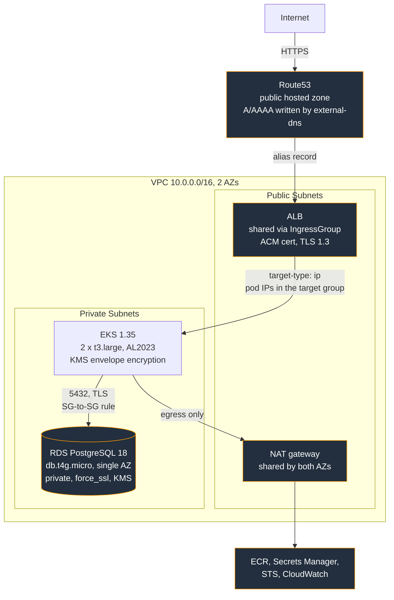
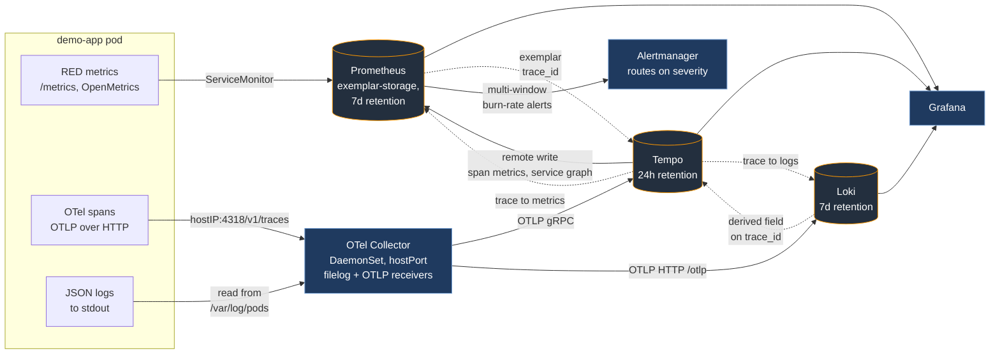

# eks-platform

SRE platform on **AWS EKS**: **VPC**, **EKS**, **RDS** and a **demo app**, deployed through **GitOps** with end to end observability, and shipped through a pipeline that builds, scans and signs the image without ever holding cluster credentials.

Terraform provisions **AWS**.\
**ArgoCD** owns the cluster.\
**CI** builds, scans, signs and commits.\
**Argo** reconciles from Git.

Live at `https://incode-demo.grandemeks.tech` when the environment is up.

## Architecture

Three diagrams: where things run, how a change gets deployed, and how it is monitored.

### Infrastructure and the request path



### How a change reaches the cluster

  ```mermaid
  flowchart TB
      dev["Developer"] -->|"pull request"| gh["GitHub<br/>main branch"]

      gh --> prc["pr-checks<br/>fmt, validate, tflint, trivy,<br/>plan, helm lint, gitleaks"]
      gh --> envwf["environment<br/>terraform apply / destroy<br/>dispatch + required reviewer"]
      gh --> rel["app-release<br/>trivy, build, trivy, SBOM,<br/>cosign, push, commit digest"]

      rel -->|"OIDC federation"| ecr[("ECR<br/>immutable tags")]
      rel -->|"commit"| gh

      envwf -->|"terraform apply"| tf["Terraform<br/>bootstrap: state, KMS, DNS, ECR, ACM<br/>envs/dev: VPC, EKS, RDS, IRSA"]
      tf -->|"helm_release"| argo["Argo CD<br/>app-of-apps root"]

      gh -.->|"polled every 3 min"| argo
      argo -->|"wave 0"| w0["LB controller, external-dns,<br/>External Secrets"]
      argo -->|"wave 1"| w1["Prometheus, Loki, Tempo,<br/>OTel Collector"]
      argo -->|"wave 2"| w2["demo-app"]
      ecr -.->|"pulled by digest"| w2

      classDef ci fill:#2d2a3e,stroke:#a78bfa,color:#ffffff
      classDef k8s fill:#1f3a5f,stroke:#7aa6da,color:#ffffff
      class prc,envwf,rel ci
      class argo,w0,w1,w2 k8s
  ```

**Waves** matter:\
**External Secrets** has to exist before the app, or its `ExternalSecret` has no controller and the pod starts without a database credential.\
The collector has to exist before the app, or the first spans are emitted into nothing.

### Observability data flow

**Metrics, logs and traces** are cross-linked both ways. A latency spike on the dashboard gets you the trace of the request that caused it, and from that trace you get the log lines the pod wrote while serving it.



## Stack

| Layer | Tool |
|---|---|
| **Infrastructure** | Terraform with two stacks: `bootstrap` (persistent) and `envs/dev` (ephemeral) |
| **Kubernetes** | EKS 1.35, hand-written modules (network, eks, database, irsa-role) |
| **GitOps** | Argo CD, App-of-Apps pattern, sync waves |
| **Ingress** / DNS | AWS Load Balancer Controller, external-dns, ACM |
| **Secrets** | External Secrets Operator, RDS-managed master password, per-namespace IRSA |
| **Observability** | Prometheus, Loki, Tempo, OTel Collector and Grafana |
| **CI/CD** | GitHub Actions, OIDC federation, Cosign keyless signing |

## Repository layout

```
terraform/
  bootstrap/        state bucket, KMS key, DNS zone, ECR, ACM cert, CI OIDC roles
  envs/dev/         VPC, EKS, RDS, IRSA roles, Grafana creds, Argo CD bootstrap
  modules/          network, eks, database, irsa-role

app/                Go demo service with RED metrics, OTel traces, structured logs

helm-charts/
  demo-app/         the only chart written by hand

argocd/
  bootstrap/        the single app Terraform creates (app-of-apps root)
  argo-manifests/   every other app, discovered from here
  configs/          values files per app and per env, including demo-app/values-dev.yaml

scripts/
  teardown.sh       ordered drain + destroy + orphan sweep + verification
  sync-values.sh    copies Terraform outputs into argocd/configs after a rebuild

.github/workflows/
  pr-checks.yaml    plan, helm lint, secret scan with no apply path
  environment.yaml  the only workflow that touches infrastructure
  app-release.yaml  build, scan, sign, commit with no cluster credentials

docs/
  decisions.md      the design decisions, the alternatives, and the trade-offs
  runbook.md        one section per alert, linked from each alert's runbook_url
```

## Quick start

```bash
# Bring the environment up (environment workflow: up), or locally:
cd terraform/bootstrap && terraform apply   # first time only
cd ../envs/dev && terraform apply

# Point kubectl at EKS
aws eks update-kubeconfig --name eks-platform-dev --region eu-central-1

# A rebuilt environment gets a new RDS secret ARN, a new VPC id, new IRSA ARNs.
# Argo CD reads desired state from Git, so write them back and commit:
./scripts/sync-values.sh
git add argocd/ && git commit -m "chore: sync values" && git push
kubectl -n argocd patch app root --type merge -p '{"operation":{"sync":{}}}'

# Tear down when done, incdluded in workflow: down pipeline
./scripts/teardown.sh
```

The bootstrap layer (state, KMS key, DNS zone, ECR, certificate, CI roles) is left running between sessions, at roughly $1.50/month. Everything else is destroyed.

## Two design choices

**Two Terraform stacks:** 

`bootstrap` holds what must survive a teardown: state, the **DNS delegation**, the **ECR repo** with its pushed images, the **ACM certificate.**\
`envs/dev` holds what is destroyed between sessions: **VPC**, **EKS**, **RDS** 

Separate state files mean a `destroy` in one can never reach the other.\
They are coupled only by a KMS alias lookup, no remote state reference, no outputs passed by hand.

**Terraform installs Argo CD and nothing else in the cluster.**\
Argo CD is the one component Terraform creates with `helm_release`, because it is what makes everything after it declarative. 

The load balancer controller, External Secrets, the observability stack and the demo-app are all Argo CD `Application` resources discovered from `argocd/argo-manifests/`.\
Adding a component is a pull request, not a Terraform change, and the release pipeline needs no cluster credentials, because its last action is a commit.

## Documentation

`docs/decisions.md` records the design decisions, the alternative considered in each case, and why it was rejected.
